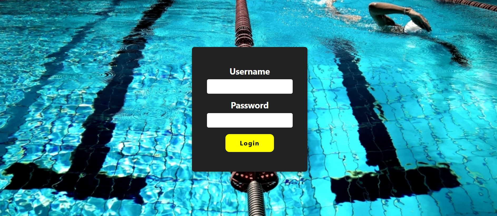
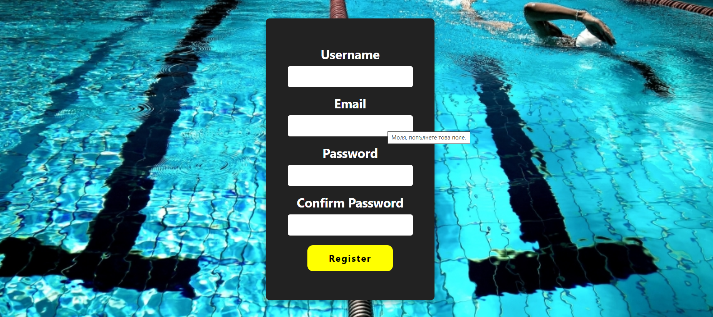
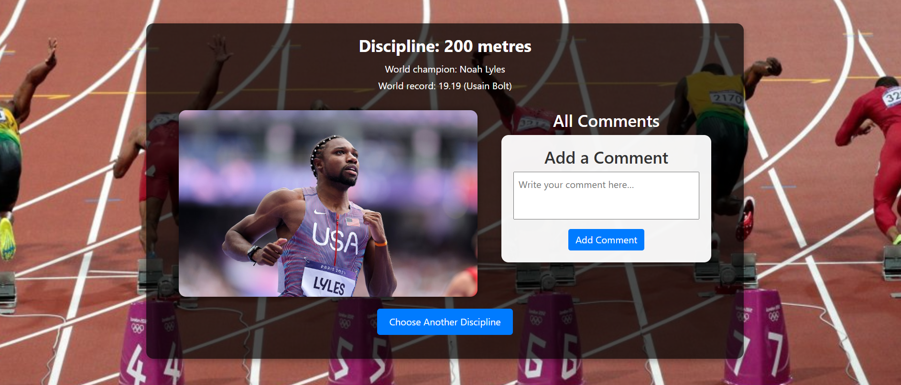
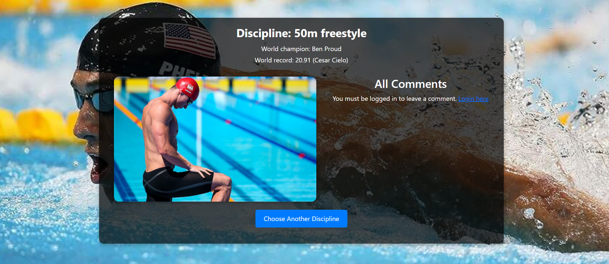

# 👋 Hello, I'm Nikola Hristov

🎯 **Junior Java Developer**  
💡 Passionate about backend development, Spring Boot, and clean architecture  
🚀 Currently working on real-world portfolio projects  

## 🛠️ Technologies & Tools


## 📂 Portfolio Projects

🔹 [🏃 Sports Statistics App (Live Demo)](https://sportsapp-web.onrender.com/)  
🔗 [GitHub Repository](https://github.com/nicolahristov/SportsApp)

A full-stack Spring Boot web application for managing athletics and swimming disciplines. Features include user registration and login, role-based access control, Cloudinary image integration, champion and world record pages, and a commenting system for logged-in users.

The app is deployed to Render and uses Railway (PostgreSQL) as the production database.  
Schema migrations are managed by Flyway to ensure consistency across environments and support version control of the database structure.

## 🖼️ Screenshots

### 🔐 Login Page


### 📝 Register Page


### 🏃 Athletics Page


### 🏊 Swimming Page


### 🏅 Swimming 50m Champion


## 🔧 Getting Started

To run this project locally, follow these steps:

### ✅ Prerequisites

- Java 17 or higher  
- Maven  
- Git  
- PostgreSQL database (Railway for production deployment, local PostgreSQL optional) 

---

### 📦 Clone the Repository

```bash
git clone https://github.com/nicolahristov/SportsApp.git
cd SportsApp
``` 

### ⚙️ Configuration Setup

Create the following configuration files in the root directory (they are excluded via `.gitignore`):

#### `application-secret.yml`

```yaml
cloudinary:
  cloud-name: YOUR_CLOUD_NAME
  api-key: YOUR_API_KEY
  api-secret: YOUR_API_SECRET

admin:
  email: YOUR_ADMIN_EMAIL
  username: YOUR_ADMIN_USERNAME
  password: YOUR_SECURE_PASSWORD
``` 

#### `.env` *(optional)*

```properties
# You can use this to override secret values locally if needed
You can choose between two profiles depending on the environment:
```

### ☁️ Option 1: Run with Railway

This is the default and recommended setup to simulate a production environment:
```

```bash
mvn spring-boot:run -Dspring.profiles.active=railway
```
Make sure application-railway.yml contains your JDBC URL

### 🛠️ Option 2: Run Locally with MySQL

If you prefer to use a local MySQL server:

```bash
mvn spring-boot:run -Dspring.profiles.active=mysql
```
The local database will auto-create if it doesn't exist. Update credentials in application-mysql.yml if needed.

### 🌍 Access the App

Once the app is running, open:

[http://localhost:8080](http://localhost:8080)

You can register a new user or use your predefined admin credentials from application-secret.yml.

For testing admin features, use:
Username: admin
Password: admin123


## 🧠 Currently & Availability

- 🎯 **Currently learning:** Spring Security
- 👀 **Open to work:** Junior Java Developer roles (remote or on-site)  
- 📌 **Fun fact:** I enjoy building sports-related web apps — and since the beginning of this year, I’ve also been learning to play the traditional Bulgarian bagpipe (gaida)!


## 📈 GitHub Stats


## 🌐 Find me around the web

- 💼 [LinkedIn](https://www.linkedin.com/in/nikola-hristov-54800236a/)
- 🌍 [Portfolio Website](https://sportsapp-web.onrender.com)
- ✉️ Email: swimmingman23@abv.bg

